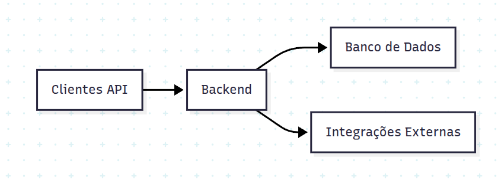

# **PaymentControl**
## **1. Introdução**
Este documento apresenta o modelo de projeto do sistema `PaymentControl`", teste ténico para medir as habilidades de um indivíduo;
Este documento está composto em tópicos, respectivamente:  
2: Objetivo  
3: Stack Técnica  
4: Segurança  
5: Diagrama da Arquitetura  
6: Principais Rotas  
7: Camada de Interface do Usuário  
8: Camada de Regra de Negócio e Padrão de Projeto  
9: Explicando decisões arquiteturais  
10: Conclusão

## 2. Objetivo
      Em uma era voltada em quase 100% para a tecnologia, existem diversos problemas e dificuldades para o continuamento dessa engrenagem, um deles se reside nos pagamentos e consultas bancárias online onde existem muitas agências que não possuem assistências físicas, forçando o usuário e as empresas a se adequarem ao "novo". Tendo em vista tais afirmações, nós desenvolvemos uma aplicação multi-gateway para solucionar alguns problemas: Consultas onlines e pagamentos, Os usuários não possuirão registro apenas em um banco, podendo ser multíplas as integrações com as intituições e entre outros problemas. 

## 3. Stack Técnica
- Linguagem de programação: PHP
- Banco de Dados: PostgreSQL
- Conteinerização: Docker
- Curl e Insomnia

## 4. Segurança
A aplicação possui segurança em seus dados,sendo imune a SQL injection, e outros ataques que podem corromper o sistema, como multiplas requisições instantaneamente. Também é utilizado
tokens e senhas de acesso aos dados privados.

## 5. Diagrama de Arquitetura 

## 6. Principais Rotas
[...]

## 7. Camada de Interface do Usuário
Não existe layouts, apenas o cliente API (Insomnia, Postman, CURL)

## 8. Camada de Regra de Negócio e Padrão de Projeto
Uma camada em específico para validações de rotas, (Campos obrigatórios), outra para as regras de negócios (Pagamento sem saldo), outra camada para conexão ao banco de dados (Consultas e Escritas SQL) e uma última camada para receber as requisições e redirecionar para a camada correspondente.

## 9. Explicando decisões arquiteturais  

Foi definido a linguagem PHP por ser uma linguagem robusta para criar uma API RESTful, que se comunica muito bem com o Nginx. Nginx é um WebServer que ficará responsável por renderizar o projeto em uma camada web. Para expor as portas de forma dinâmica e containerização, usaremos docker e php-fpm. O PHP-FPM será responsável por integrar o php ao servidor web, além de melhorar os processamentos de scripts, tornando os mesmo mais rápidos e eficiente.
  
o patrão de Arquitetura: **MVC** (Model, View, Controller), composto pelos respectivos componentes:
- Model: Responsável pelas regras de negócios  
- View: Não existe layout, a view seria os clientes API
- Controller: Responsável por controlar as rotas e devolver as respostas para o requisitante. Dispacha as requisições para as services.
-  Service: Validações de rotas, quais campos são necessários e chamadas de model e repositories.
- Repository: Conexão, escritas e consultas no banco de dados.

## 10.Conclusão
[...]
